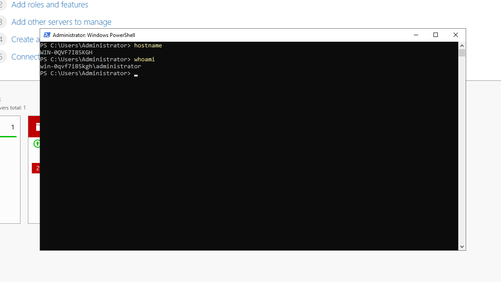
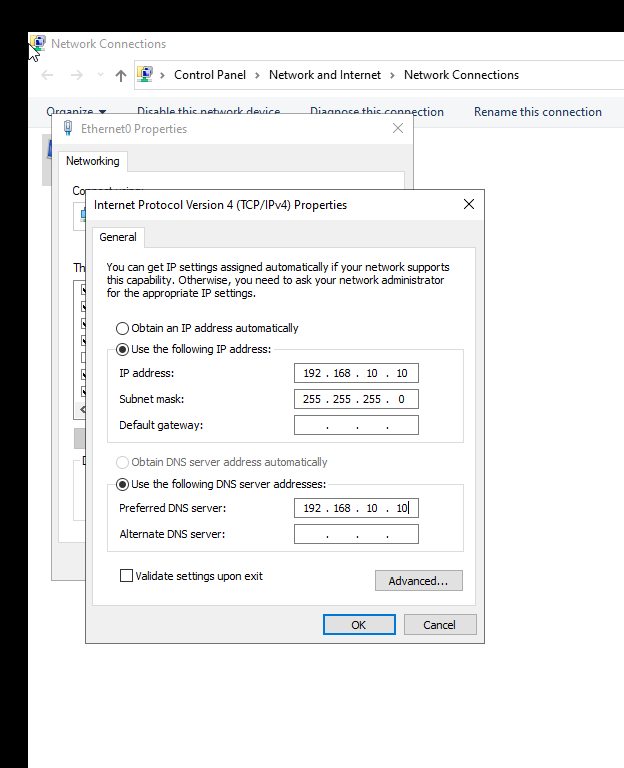
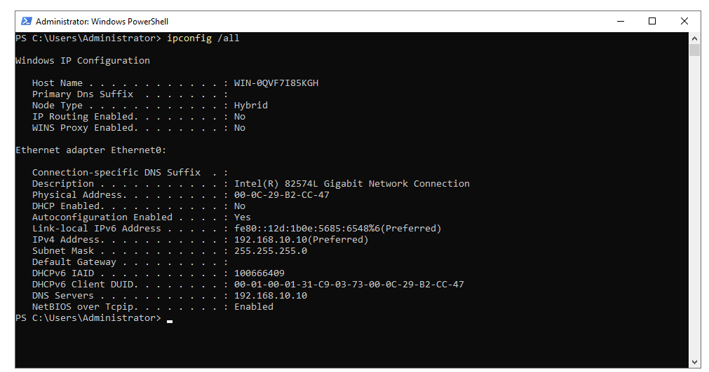

# 🔧 Environment Setup

## 🎯 Objective

This phase documents the preparation of the base infrastructure for an Active Directory lab. A Windows Server 2022 virtual machine is deployed, network settings are configured, and connectivity is validated as a prerequisite for installing Active Directory Domain Services (AD DS).

---

## Environment

| Component | Configuration |
|----------|---------------|
| Hypervisor | VMware Workstation Pro 17 |
| Operating System | Windows Server 2022 Desktop Experience |
| Hostname | DC01 |
| Network | Host-Only |
| IP Address | 192.168.10.10/24 |
| DNS Server | 192.168.10.10 |

---

## Tasks Completed

- [x] Create Windows Server 2022 virtual machine
- [x] Configure VMware Host-Only network
- [x] Rename server to **DC01**
- [x] Configure a static IPv4 address
- [x] Configure DNS to point to the future Domain Controller
- [x] Validate network configuration

---

## Validation

The server was successfully configured with a static IP address and validated for network connectivity. This provides a stable foundation for deploying Active Directory Domain Services in the next phase.

---

## 📸 Screenshots

### 1. DC01 Base Setup

---

### 2. Network Configuration

---

### 3. Network Validation

---

## Outcome

The base infrastructure has been successfully deployed and configured. The server is ready for Active Directory Domain Services (AD DS) installation and promotion to a Domain Controller.