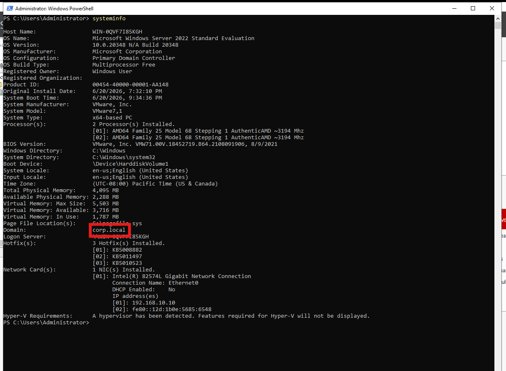

# 🏗️ Phase 2 - Active Directory Deployment

## 🎯 Objective

Deploy Active Directory Domain Services (AD DS) and promote DC01 to the first Domain
Controller of the `corp.local` forest - establishing the identity infrastructure used
throughout the remainder of the lab.

---

## 🧱 Environment

| Component | Value |
|-----------|-------|
| Server Name | DC01 |
| OS | Windows Server 2022 |
| Domain | corp.local |
| Forest | corp.local |
| Forest / Domain Functional Level | Windows Server 2016 |
| DNS | AD-Integrated |
| IP Address | 192.168.10.10 |

---

## ✅ Tasks Completed

- [x] Install the AD DS role via Server Manager
- [x] Promote DC01 to Domain Controller
- [x] Create new forest (`corp.local`)
- [x] Configure AD-integrated DNS
- [x] Restart and verify deployment

---

## 🔧 Deployment Steps

### 1. AD DS Role Installation

The Active Directory Domain Services role was installed through Server Manager
(`Add Roles and Features`), along with the required management tools.

---

### 2. Domain Controller Promotion

After role installation, DC01 was promoted to Domain Controller using the
AD DS Configuration Wizard, creating a new forest with `corp.local` as the
root domain and enabling AD-integrated DNS.

---

### 3. Domain Validation

System Information confirms DC01 is joined to `corp.local` and operating
as a Domain Controller.

---

### 4. Active Directory Users and Computers

The ADUC console shows the default containers, confirming the domain
structure was created successfully.

---

### 5. Active Directory Domains and Trusts

Confirms the forest root domain and trust structure.

---

## 🧠 Key Learnings

- Promoting the first DC automatically creates the forest, domain, and initial
  OU structure - no manual forest creation required
- AD DS requires DNS to function; AD-integrated DNS is the recommended approach
  as it replicates zone data through AD itself
- Forest and Domain Functional Levels determine which AD features are available —
  setting them correctly from the start avoids future migration overhead
- Verifying deployment through ADUC and `dcdiag` before continuing prevents
  compounding issues in later phases

---

## ✅ Outcome

DC01 is operational as the forest root Domain Controller for `corp.local`, providing:

| Service | Status |
|---------|--------|
| Kerberos Authentication | ✅ Active |
| LDAP Directory Services | ✅ Active |
| AD-Integrated DNS | ✅ Active |
| Centralized Identity Management | ✅ Active |

👉 **Next:** [Phase 3 - DNS Configuration & Domain Validation](../03-Domain-Configuration/)