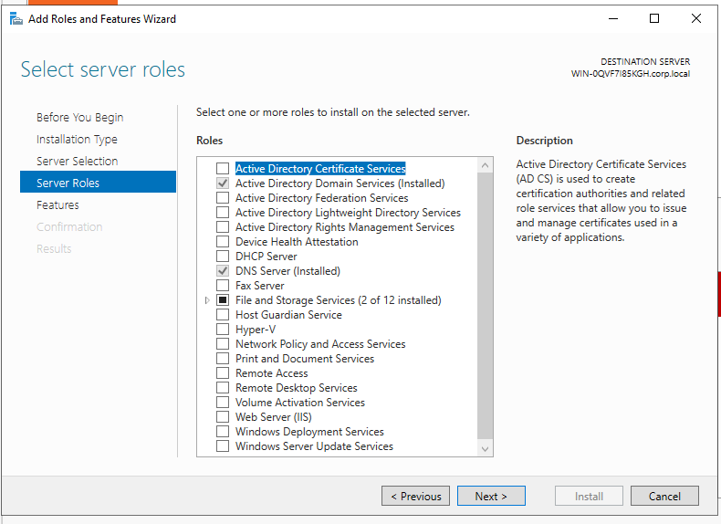
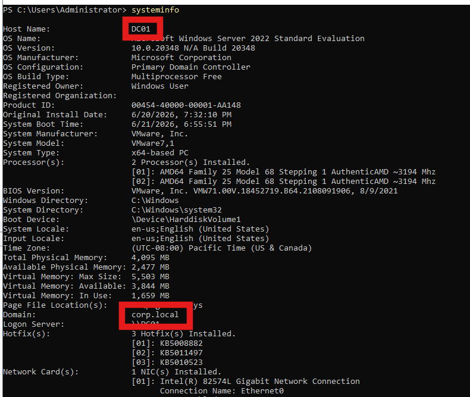
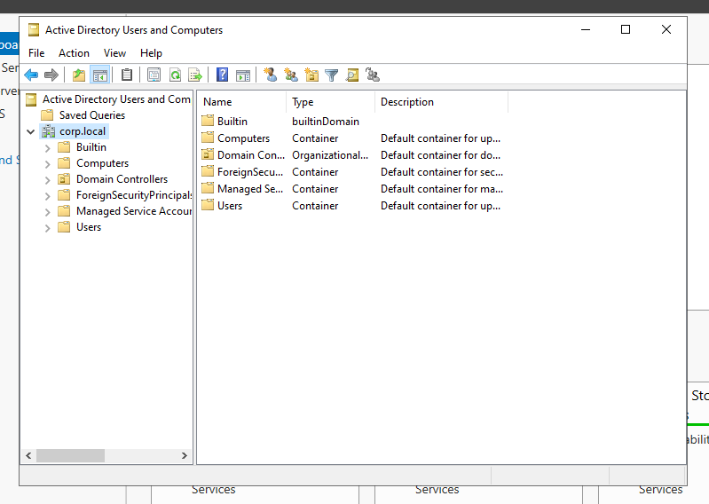
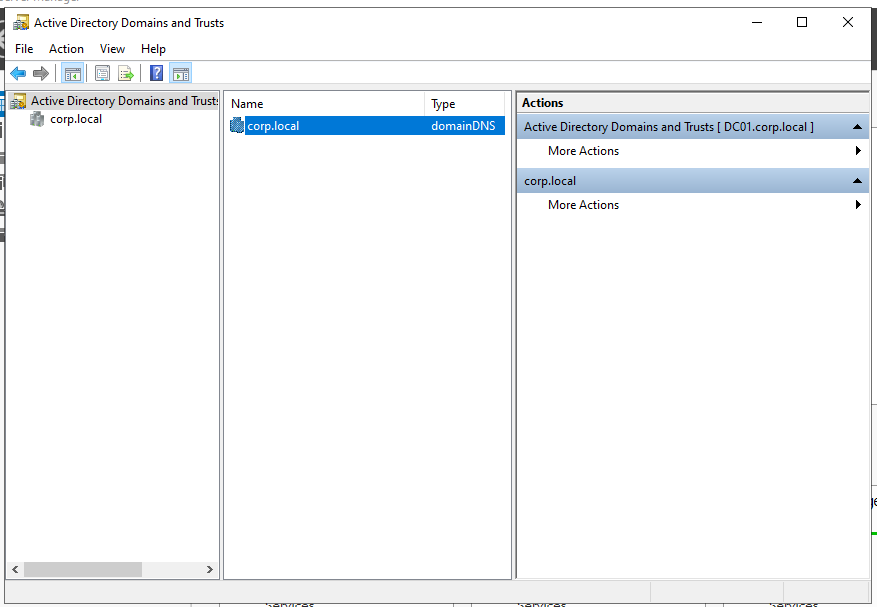

# 🏗️ Active Directory Deployment

## 🎯 Objective

Deploy Active Directory Domain Services (AD DS) and promote the Windows Server 2022 host to the first Domain Controller of the `corp.local` domain. This phase establishes the identity infrastructure that will be used throughout the remainder of the lab.

---

## Environment

| Component | Value |
|----------|-------|
| Server Name | DC01 |
| Operating System | Windows Server 2022 |
| Domain | corp.local |
| Forest | corp.local |
| DNS | Integrated with Active Directory |

---

## Tasks Completed

- [x] Install the Active Directory Domain Services (AD DS) role
- [x] Promote the server to Domain Controller
- [x] Create a new Active Directory forest (`corp.local`)
- [x] Configure integrated DNS
- [x] Restart the server after promotion
- [x] Verify Active Directory deployment

---

## Validation

The deployment was validated by confirming:

- The AD DS role was successfully installed.
- The server was promoted to a Domain Controller.
- The `corp.local` domain was created successfully.
- Active Directory administrative tools are available.
- The server is operating as the first Domain Controller of the forest.

---

## 📸 Screenshots

### 1. AD DS Role Installed

---

### 2. Domain Validation

Verification using **System Information** confirms that the server belongs to the `corp.local` domain.

---

### 3. Active Directory Users and Computers

The Active Directory console displays the default containers and confirms that the domain was created successfully.

---

### 4. Active Directory Domains and Trusts

Validation of the Active Directory domain and forest structure.

---

## Outcome

The first Domain Controller has been successfully deployed and configured.

The lab now provides:

- Centralized identity management
- Kerberos authentication
- LDAP directory services
- Integrated DNS
- Administrative tools for managing Active Directory

This environment is now ready for domain configuration, identity management, Group Policy, attack simulations, and detection engineering.

---

## Lessons Learned

- Active Directory deployment requires proper DNS integration.
- Promoting the first Domain Controller automatically creates the initial forest and domain.
- Verifying the deployment using administrative consoles is essential before continuing with additional configuration.
- A properly configured Domain Controller serves as the foundation for all subsequent identity and security operations.