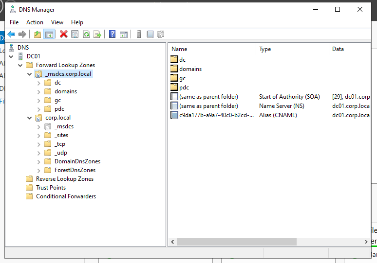
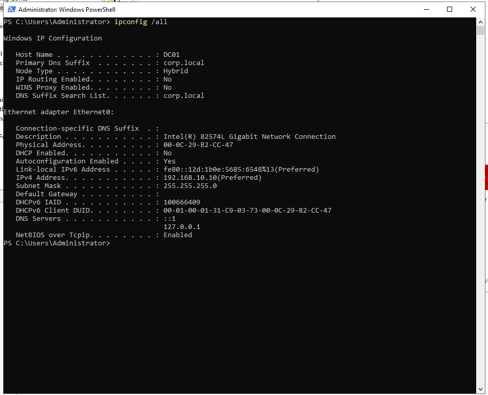
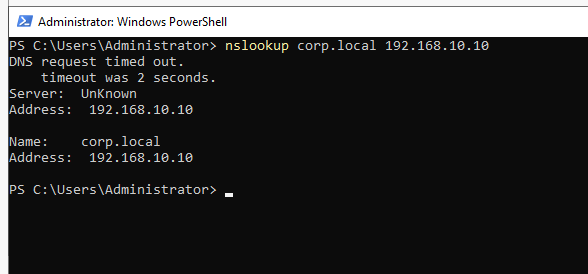
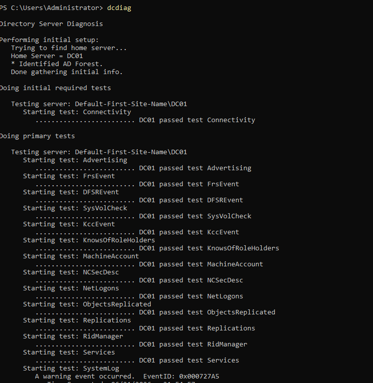
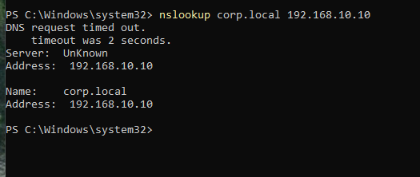
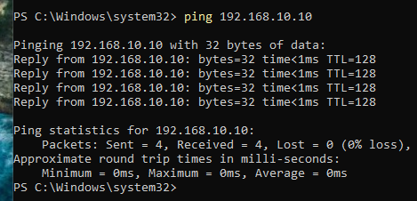

# 🌐 Phase 3 - DNS Configuration & Domain Validation

## 🎯 Objective

Validate that DNS and Active Directory Domain Services (AD DS) are correctly configured
and fully operational in the `corp.local` domain - covering name resolution, domain
health, and client connectivity.

---

## 🧱 Environment

| Component | Details |
|-----------|---------|
| Domain Controller | DC01 - 192.168.10.10 |
| Client Machine | WS01 - 192.168.10.20 |
| Domain | corp.local |
| Network | VMware Host-Only (192.168.10.0/24) |

---

## 🔧 DNS Configuration

DC01 acts as the primary DNS server for the domain with AD-integrated DNS enabled.

| Setting | Value |
|---------|-------|
| DNS Role | Installed on DC01 |
| Forward Lookup Zone | corp.local |
| DC01 DNS (self) | 192.168.10.10 |
| Zone Type | Active Directory Integrated |

| DNS Manager | IP Configuration |
|-------------|-----------------|
|  |  |

---

## 🔍 Validation Tests

### 1. DNS Resolution - DC01

Verified that `corp.local` resolves correctly from the domain controller itself.

- **Command:** `nslookup corp.local`
- **Result:** ✅ Resolved to `192.168.10.10`

---

### 2. Active Directory Health Check

`dcdiag` confirms all core AD services are healthy and operational.

- **Command:** `dcdiag /v`
- **Result:** ✅ All tests passed

---

### 3. DNS Resolution - WS01

Verified that the client resolves `corp.local` using DC01 as its DNS server.

- **Command:** `nslookup corp.local` (from WS01)
- **Result:** ✅ Resolved via 192.168.10.10

---

### 4. Network Connectivity - WS01 → DC01

Confirmed layer 3 connectivity between client and domain controller.

- **Command:** `ping 192.168.10.10`
- **Result:** ✅ Replies received, no packet loss

---

## ⚠️ Issues & Troubleshooting

| Issue | Cause | Resolution |
|-------|-------|------------|
| nslookup initial timeout | VMware Host-Only network latency | Waited for network stabilization |
| dcdiag DNS warnings (wpad, SPNs) | Expected in minimal lab environments | Confirmed non-critical, no action needed |

**Troubleshooting steps taken:** DNS cache flush → Netlogon service restart → Connectivity revalidation.

---

## 🧠 Key Learnings

- AD DS is entirely dependent on DNS - misconfigured DNS breaks domain functionality
- SRV records registered automatically by Netlogon enable domain service discovery
- `dcdiag` is the primary tool for validating domain controller health
- Not all `dcdiag` warnings indicate failures - context matters in lab vs. production
- Virtual network adapters can introduce brief latency on first DNS queries

---

## ✅ Outcome

The `corp.local` domain is fully operational. DNS resolves correctly from both DC01
and WS01, `dcdiag` reports no critical failures, and client-to-DC connectivity is stable.

👉 **Next:** [Phase 4 - Identity Management](../04-Identity-Management/)