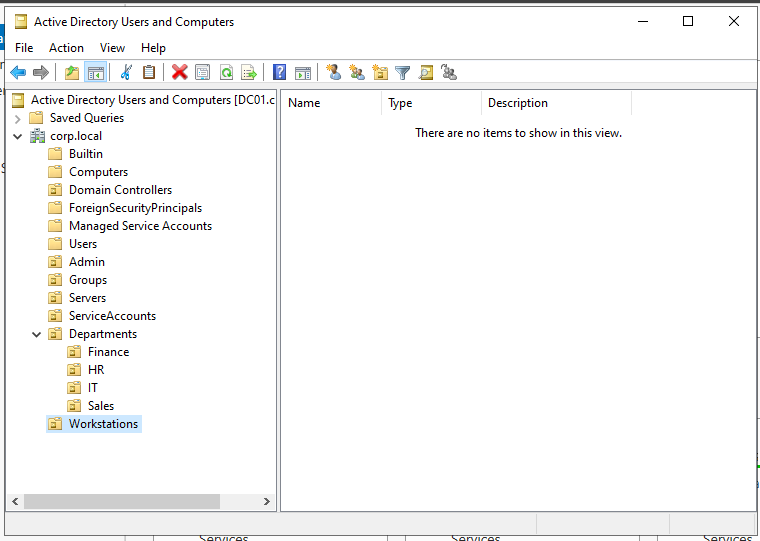
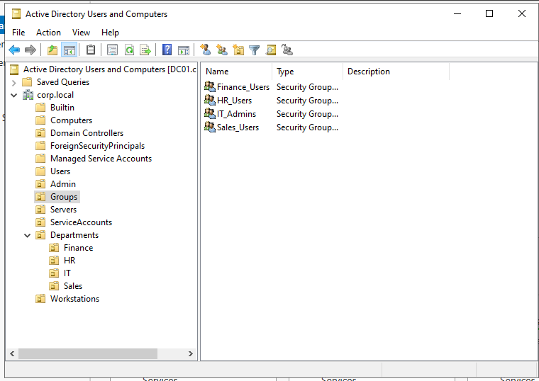
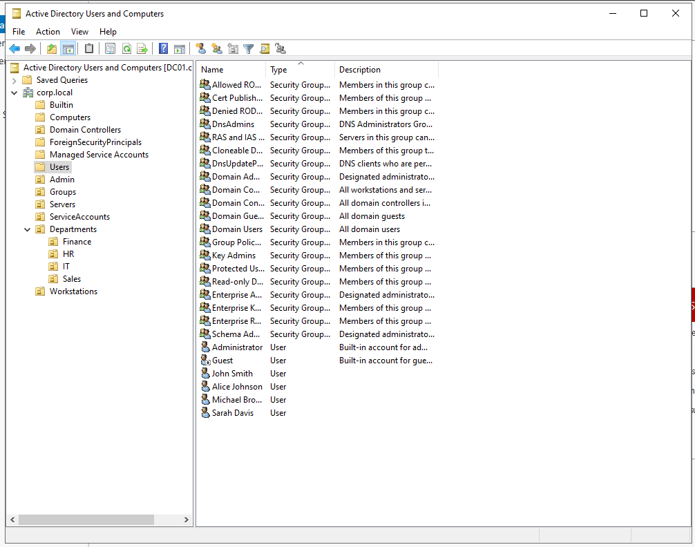
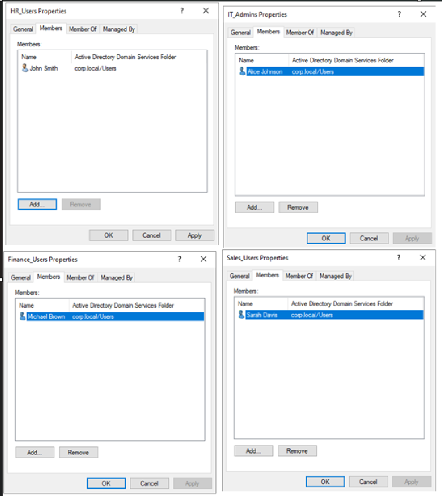
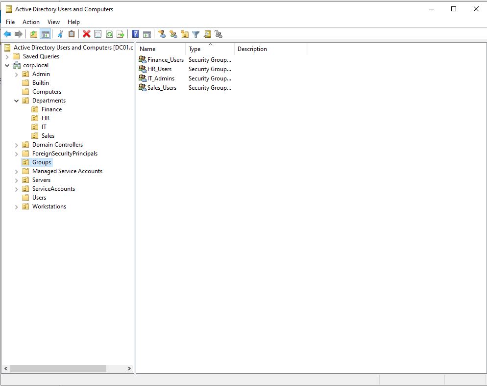

# 👥 Phase 4 - Identity Management

## 🎯 Objective

Establish the organizational structure of the `corp.local` domain by designing a
hierarchical OU layout, creating security groups, and provisioning user accounts —
simulating a realistic enterprise identity infrastructure for use in future GPO,
delegation, attack simulation, and detection engineering phases.

---

## 🧱 OU Structure

A hierarchical structure was designed to logically separate administrative resources,
departments, servers, workstations, and service accounts.

```text
corp.local
│
├── Admin               # Privileged administrator accounts
├── Departments
│   ├── Finance
│   ├── HR
│   ├── IT
│   └── Sales
├── Groups              # Centralized security group management
├── Servers             # Member servers (FS01, etc.)
├── Service Accounts    # Non-interactive service identities
└── Workstations        # Domain-joined client machines (WS01)
```



---

## 👥 Security Groups

Global Security Groups were created per department to enforce role-based access control (RBAC).

| Group | Scope | Type | Purpose |
|-------|-------|------|---------|
| IT_Admins | Global | Security | IT department - elevated permissions |
| HR_Users | Global | Security | HR department - standard access |
| Finance_Users | Global | Security | Finance department - standard access |
| Sales_Users | Global | Security | Sales department - standard access |



---

## 👤 User Accounts

Sample users were provisioned to represent employees across departments, each placed
in their corresponding departmental OU.

| Full Name | Username | Department | OU |
|-----------|----------|------------|----|
| Alice Johnson | ajohnson | IT | Departments/IT |
| John Smith | jsmith | HR | Departments/HR |
| Michael Brown | mbrown | Finance | Departments/Finance |
| Sarah Davis | sdavis | Sales | Departments/Sales |



---

## 🔐 Group Membership

Each user was assigned to their departmental security group following least-privilege principles.

| User | Group | Role |
|------|-------|------|
| ajohnson | IT_Admins | IT Administrator |
| jsmith | HR_Users | HR Employee |
| mbrown | Finance_Users | Finance Employee |
| sdavis | Sales_Users | Sales Employee |



---

## 🏢 Final AD Structure



---

## 🧠 Key Learnings

- A well-designed OU structure is foundational - it directly impacts GPO scope,
  delegation boundaries, and administrative efficiency
- Security Groups decouple identity from permissions, enabling scalable RBAC
- Placing users in departmental OUs from the start simplifies future policy targeting
- Separating `Service Accounts` and `Admin` into dedicated OUs reflects tiered
  administration best practices and reduces attack surface
- This structure now provides realistic attack targets for Kerberoasting (SPNs on
  service accounts) and BloodHound enumeration in later phases

---

## ✅ Outcome

The `corp.local` domain now has a structured identity model with departmental OUs,
role-based security groups, and provisioned user accounts - ready to support GPO
deployment, administrative delegation, and attack simulation.

👉 **Next:** [Phase 5 - Client Integration](../05-Client-Integration/)