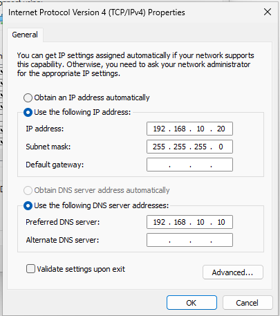
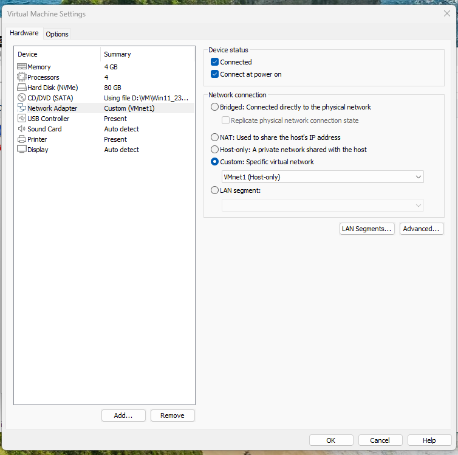
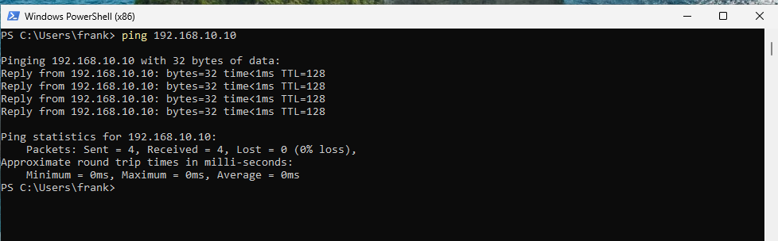
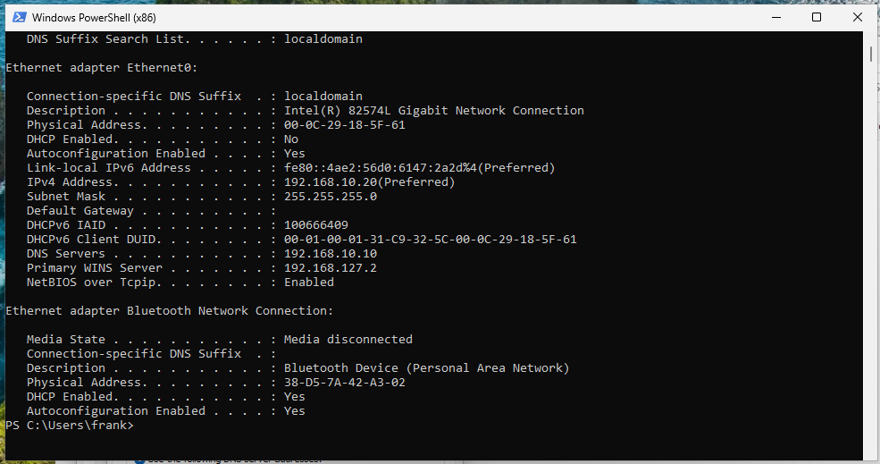

# 💻 Phase 5 — Client Integration (WS01 Domain Join)

## 🎯 Objective

Integrate the Windows 11 client (WS01) into the `corp.local` domain by validating
network connectivity, DNS resolution, and domain authentication — making WS01 a
managed endpoint within the Active Directory environment.

---

## 🧱 Environment

| Component | Details |
|-----------|---------|
| Domain Controller | DC01 — 192.168.10.10 |
| Client Machine | WS01 — 192.168.10.20 |
| Domain | corp.local |
| DNS Server | 192.168.10.10 (DC01) |
| Network | VMware Host-Only (192.168.10.0/24) |

---

## 🌐 Step 1 — Network Validation

WS01 network configuration was verified before attempting the domain join.

| Check | Result |
|-------|--------|
| Static IP assigned | ✅ 192.168.10.20/24 |
| DNS pointing to DC01 | ✅ 192.168.10.10 |
| Ping DC01 | ✅ Successful |
| DNS port reachable | ✅ `Test-NetConnection 192.168.10.10 -Port 53` → `TcpTestSucceeded: True` |

| IP Configuration | VM Network Setup |
|-----------------|-----------------|
|  |  |

| Ping DC01 | IPConfig /all |
|-----------|--------------|
|  |  |

---

## ⚠️ Issues & Troubleshooting

Three issues were encountered and resolved before the domain join succeeded.

### 1. Incorrect Credentials

The domain join failed with a misleading authentication error.

**Error:** `The username or password is incorrect`  
**Cause:** Local machine credentials were used instead of domain administrator credentials.  
**Fix:** Use the fully qualified domain account format:

```text
✅ CORP\Administrator
❌ Administrator  (resolves to local account)
```

> **Note:** This is one of the most common domain join mistakes. The error message
> implies a wrong password, but the real issue is the wrong credential *context*.

---

### 2. DNS Resolution Delays

Initial DNS queries from WS01 showed intermittent timeouts before eventually resolving.

**Cause:** VMware Host-Only network latency on first query.  
**Fix:** Flushed DNS cache on DC01 and restarted Netlogon — subsequent queries resolved immediately.

---

### 3. IPv6 DNS Interference

DC01 had IPv6 DNS configured (`::1`), causing inconsistent resolution behavior.

**Fix:** Disabled IPv6 DNS on DC01's network adapter to enforce IPv4-only resolution
in the lab environment.

---

## 🔗 Step 2 — Domain Join

After resolving the above issues, WS01 was joined to `corp.local` via
**System Properties → Change → Domain** using `CORP\Administrator`.

---

## 🔍 Step 3 — Verification

### Domain Membership (WS01)

```powershell
systeminfo | findstr Domain
```
```text
Domain: corp.local
```

### Active Directory Object (DC01)

WS01 appears in the **Computers** container in ADUC, confirming the computer
object was automatically created upon domain join.


---

## 🧠 Key Learnings

- Domain join errors often report `incorrect password` even when the real issue is
  wrong credential context — always use `DOMAIN\username` format
- A domain join is fundamentally a DNS operation — if DNS fails, the join fails
- IPv6 should be disabled or carefully managed in lab environments to avoid
  interfering with IPv4 DNS behavior
- AD automatically creates a computer object in the `Computers` container on
  successful join — this is the first sign of a managed endpoint
- `Test-NetConnection -Port 53` is more reliable than `ping` for validating DNS
  reachability specifically

---

## ✅ Outcome

WS01 is joined to `corp.local`, verified both locally (`systeminfo`) and in Active
Directory (ADUC Computers container). The lab now has a fully managed Windows 11
endpoint communicating with DC01 for authentication and DNS.

👉 **Next:** [Phase 6 — Group Policy & Security Hardening](../06-Security-Hardening/)