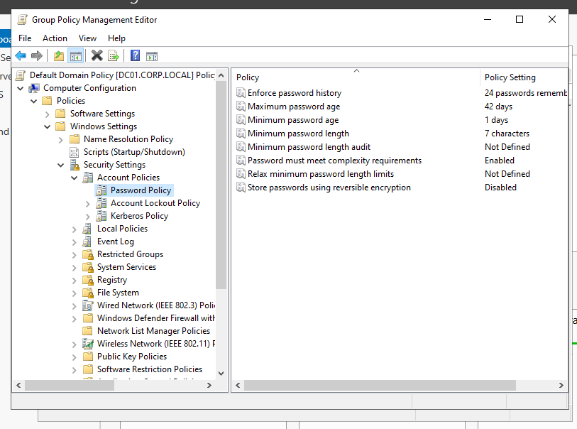
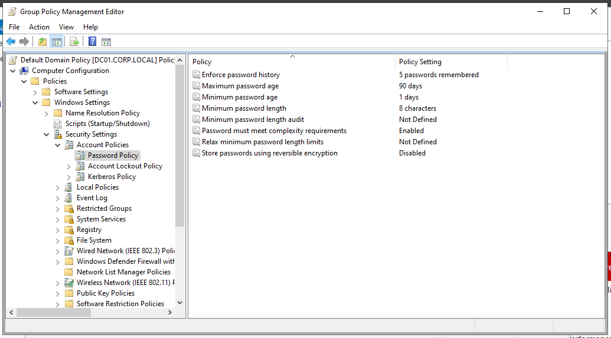
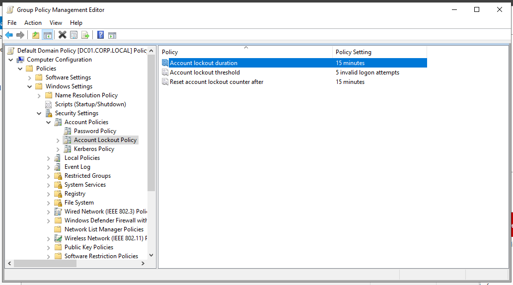
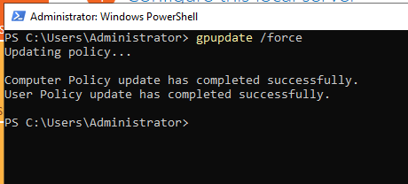
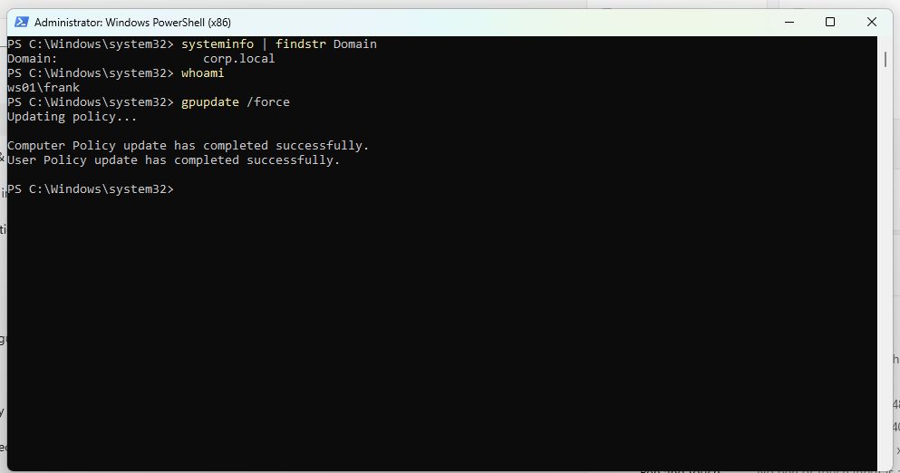
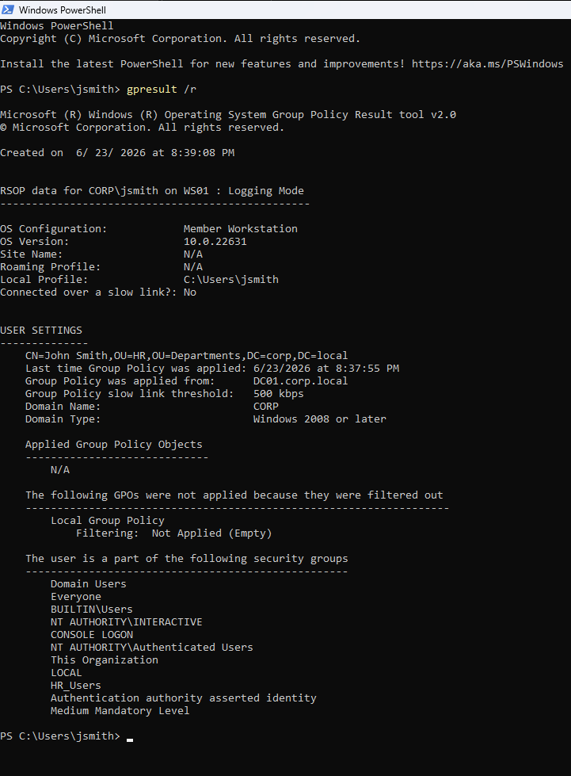
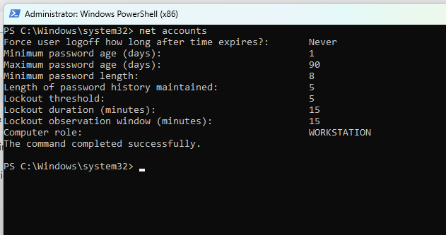

# 🔐 Phase 6 - Security Hardening (GPO Baseline)

## 🎯 Objective

Strengthen the `corp.local` environment by applying baseline security policies
through Group Policy Objects (GPOs) - enforcing password complexity, account
lockout controls, and validating policy propagation across domain-joined clients.

---

## 🧱 Environment

| Component | Details |
|-----------|---------|
| Domain Controller | DC01 - 192.168.10.10 |
| Client Machine | WS01 - 192.168.10.20 |
| Domain | corp.local |
| Policy Tool | Group Policy Management Console (GPMC) |

---

## 🔒 Step 1 - Password Policy

The **Default Domain Policy** was edited to enforce enterprise-grade password requirements.

| Policy | Value | Rationale |
|--------|-------|-----------|
| Enforce password history | 5 passwords | Prevents immediate password reuse |
| Maximum password age | 90 days | Limits exposure window of compromised credentials |
| Minimum password age | 1 day | Prevents bypassing history by rapid cycling |
| Minimum password length | 8 characters | Baseline complexity requirement |
| Password complexity | Enabled | Requires mixed character types |
| Reversible encryption | Disabled | Prevents plaintext password storage |

| Default Policy | Configured Values |
|---------------|-------------------|
|  |  |

---

## 🔐 Step 2 - Account Lockout Policy

Account lockout settings were configured to mitigate brute-force and
password spraying attacks.

| Policy | Value | Rationale |
|--------|-------|-----------|
| Account lockout threshold | 5 invalid attempts | Blocks automated credential attacks |
| Account lockout duration | 15 minutes | Auto-unlocks without admin intervention |
| Reset lockout counter after | 15 minutes | Resets attempt window after idle period |



> **Attack relevance:** These settings will directly affect attack behavior in
> Phase 7 - password spraying must stay under the 5-attempt threshold to avoid
> triggering lockouts and generating Event ID 4740.

---

## 🔄 Step 3 - Policy Propagation

Policies were forced to propagate immediately on both DC01 and WS01.

```powershell
# On DC01
gpupdate /force

# On WS01
gpupdate /force
```

| DC01 GPUpdate | WS01 GPUpdate |
|---------------|---------------|
|  |  |

---

## ✅ Step 4 - Validation

### Resultant Set of Policy (RSoP)

```powershell
gpresult /r
```

Confirmed:
- Policies applied from `DC01.corp.local`
- **Default Domain Policy** applied to computer scope
- WS01 recognized as domain member



---

### Password Policy Verification

```powershell
net accounts
```

Confirmed password history, minimum length, maximum age, and lockout policy
are all active.



---

## ⚠️ Troubleshooting

### User Scope Showing N/A in gpresult

**Symptom:** `gpresult /r` showed `N/A` under **Applied Group Policy Objects**
in the User Settings section.

**Cause:** Validation was performed while logged in with the local account
(`WS01\frank`). User-scoped GPOs only apply to domain accounts (`CORP\jsmith`).

**Resolution:** The **Computer Settings** section confirmed `Default Domain Policy`
was applied correctly - this is sufficient to validate password and lockout
policy enforcement, which are computer-scoped settings.

> **Lesson:** Always distinguish between computer-scoped and user-scoped GPOs
> when validating with `gpresult`. A blank user scope is expected with local logins.

---

## 🧠 Key Learnings

- Password and lockout policies live in **Default Domain Policy** and apply
  domain-wide - creating a separate GPO for these risks being overridden by
  precedence rules
- `gpupdate /force` bypasses the default 90-minute refresh interval - essential
  in lab environments where time matters
- `gpresult /r` splits output into **Computer** and **User** scopes -
  understanding which scope applies to which setting is critical for accurate validation
- Account lockout thresholds have a direct impact on attack strategy -
  too low causes accidental lockouts; too high gives attackers too many attempts
- `net accounts` is the fastest way to confirm password policy without
  opening GPMC

---

## ✅ Outcome

The `corp.local` domain now enforces a security baseline across all domain-joined systems.

| Control | Status |
|---------|--------|
| Password complexity | ✅ Enforced |
| Password expiration (90 days) | ✅ Enforced |
| Password history (5) | ✅ Enforced |
| Account lockout (5 attempts / 15 min) | ✅ Enforced |
| Domain-wide GPO propagation | ✅ Verified |
| Client-side policy application | ✅ Validated |

👉 **Next:** [Phase 7 - Attack Simulation](../07-Attack-Simulation/)