# ⚔️ Phase 7 - Attack Simulation (Active Directory)

## 🎯 Objective

Simulate a realistic internal network attack against `corp.local` - progressing
from unauthenticated reconnaissance through authenticated domain enumeration -
to understand how AD environments are targeted and what security controls
hold up under pressure.

---

## 🧱 Environment

| Role | Host | IP |
|------|------|----|
| Domain Controller | DC01.corp.local | 192.168.10.10 |
| Workstation | WS01.corp.local | 192.168.10.20 |
| Attacker | Kali Linux | 192.168.10.30 |
| Domain | corp.local | - |

---

## 🧭 Attack Methodology

This simulation follows a structured kill chain progression:

```text
Network Validation
      ↓
DNS & Service Discovery
      ↓
Port Scanning & Service Enumeration (SMB, LDAP, RPC)
      ↓
Domain Fingerprinting
      ↓
Anonymous Enumeration Attempts
      ↓
Credential-Based Authentication
      ↓
Authenticated Domain Enumeration
```

---

## Attack Walkthrough

### 🖥️ 1. Network Validation

Confirmed Layer 3 connectivity from the attacker machine to all lab hosts
before beginning enumeration.

| Check | Result |
|-------|--------|
| Kali → DC01 ping | ✅ Reachable |
| Kali → WS01 ping | ✅ Reachable |
| Kali IP configuration | ✅ 192.168.10.30 |

| Kali IP Config | Ping DC01 | Ping WS01 |
|----------------|-----------|-----------|
| 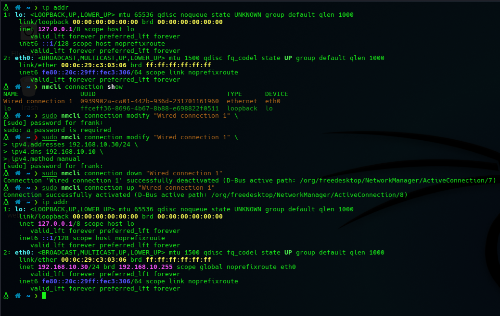 | 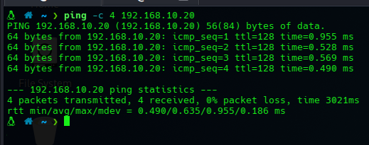 | 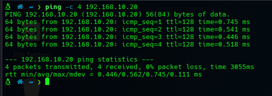 |

---

### 🌐 2. DNS & Service Discovery

DNS queries against DC01 revealed the `corp.local` domain structure and
exposed SRV records that advertise domain services - standard AD behavior
that also aids attacker enumeration.

| Query | Finding |
|-------|---------|
| `corp.local` resolution | DC01 at 192.168.10.10 |
| `_ldap._tcp.corp.local` SRV | DC01 advertising LDAP on port 389 |

| DNS Resolution | SRV Records |
|----------------|-------------|
| 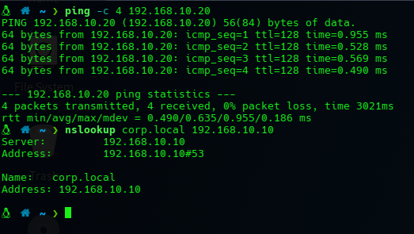 | 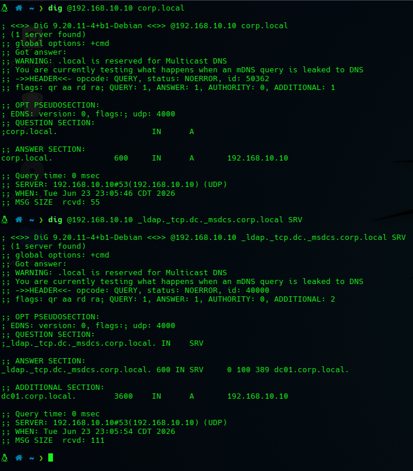 |

---

### 🔍 3. Port Scanning & Service Enumeration

Nmap revealed the classic AD service fingerprint on DC01. SMB and LDAP
enumeration confirmed share exposure and directory base.

```bash
nmap -sV -sC 192.168.10.10
```

| Service | Port | Finding |
|---------|------|---------|
| SMB | 445 | Shares visible, signing enforced |
| LDAP | 389 | Base DN: `DC=corp,DC=local` |
| RPC | 135 | Endpoint mapper responding |
| Kerberos | 88 | Active, confirms DC role |

| Nmap Scan | SMB Shares | LDAP Base |
|-----------|------------|-----------|
| 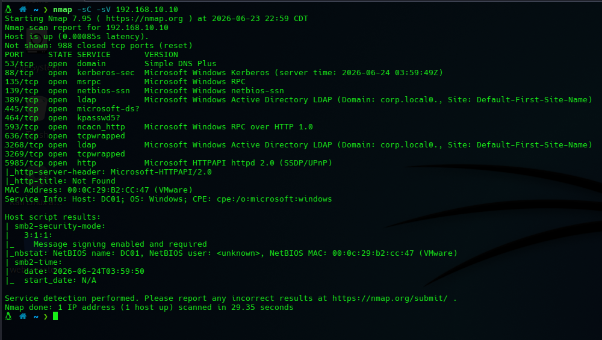 | 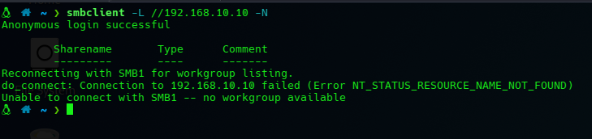 | 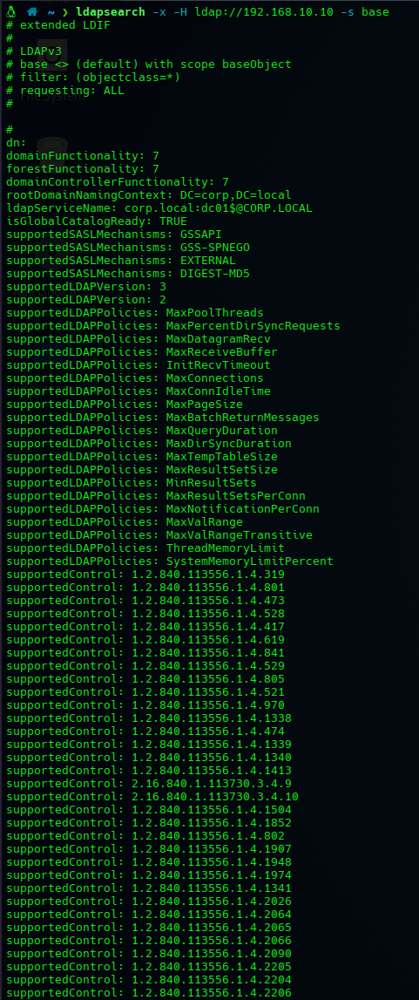 |

---

### 🧠 4. Domain Fingerprinting (NetExec)

NetExec confirmed domain metadata and SMB security configuration from
an unauthenticated context.

```bash
netexec smb 192.168.10.10
```

| Finding | Value |
|---------|-------|
| Domain | corp.local |
| OS | Windows Server 2022 |
| SMB Signing | ✅ Required |
| SMBv1 | ❌ Disabled |

| SMB Enum | Domain Enum | Fingerprint |
|----------|-------------|-------------|
| 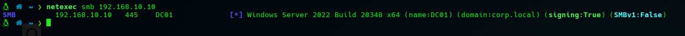 | 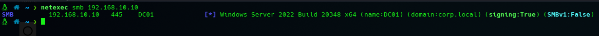 | 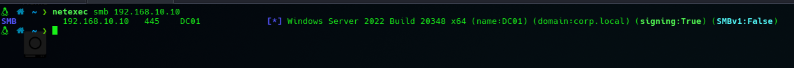 |

---

### 👤 5. Anonymous Enumeration Attempts

RPC and anonymous SMB were tested for unauthenticated user and group
enumeration - a common technique for initial AD reconnaissance.

```bash
rpcclient -U "" -N 192.168.10.10
enumdomusers
enumdomgroups
```

| Technique | Result |
|-----------|--------|
| RPC null session | ❌ Blocked |
| Anonymous SMB access | ❌ Restricted |
| RID cycling (SAMR) | ❌ Access Denied |

> **✅ Security control confirmed:** Anonymous enumeration and RID brute-force
> are blocked. LSARPC/SAMR hardening from Phase 6 is effective.

| RPC Users | RPC Groups | Anon SMB | RID Brute |
|-----------|------------|----------|-----------|
| 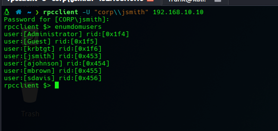 | 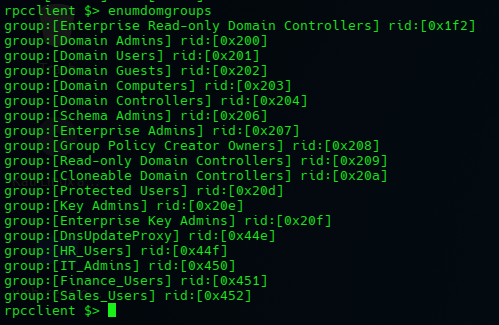 | 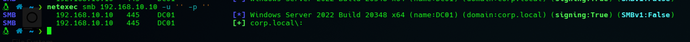 | 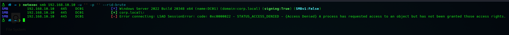 |

---

### 🔐 6. Credential-Based Access & Authenticated Enumeration

Using valid domain credentials, SMB authentication and internal enumeration
were performed - simulating an attacker with compromised credentials.

```bash
netexec smb 192.168.10.10 -u jsmith -p 'Password123' --shares
netexec smb 192.168.10.10 -u jsmith -p 'Password123' --groups
```

| Action | Result |
|--------|--------|
| SMB authentication | ✅ Successful |
| Share enumeration | ✅ Internal shares visible |
| Domain group enumeration | ✅ Groups and members retrieved |

| Authenticated SMB | Share Enum | Group Enum |
|-------------------|------------|------------|
| 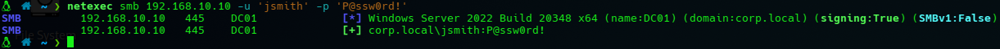 | 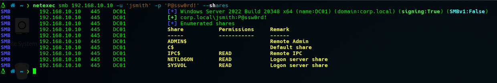 | 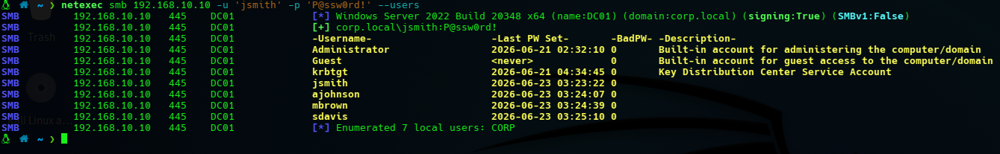 |

---

## 🧠 Key Findings

| Finding | Status | Impact |
|---------|--------|--------|
| SMB signing enforced | ✅ Secure | Prevents relay attacks (NTLM relay) |
| SMBv1 disabled | ✅ Secure | Eliminates EternalBlue attack surface |
| Anonymous RPC enumeration | ✅ Blocked | Prevents unauthenticated user harvesting |
| RID cycling (SAMR) | ✅ Blocked | Prevents account enumeration without credentials |
| Authenticated enumeration | ⚠️ Exposed | Valid credentials expose internal AD structure |
| SRV records publicly visible | ⚠️ By design | Expected AD behavior; limits scope of concealment |

---

## 🧠 Key Learnings

- SMB signing prevents NTLM relay attacks - an attacker intercepting traffic
  cannot relay credentials to authenticate elsewhere
- Anonymous enumeration controls are among the most impactful quick wins in
  AD hardening; their absence leaks the entire user and group list
- SRV records are inherently visible in AD environments - DNS-based discovery
  is expected attacker behavior, not a misconfiguration
- Credential compromise is the real turning point - unauthenticated controls
  held, but valid credentials unlocked meaningful enumeration
- `netexec` is the modern successor to CrackMapExec and the standard tool
  for SMB/LDAP validation in AD assessments

---

## ✅ Outcome

The simulation progressed through the full unauthenticated-to-authenticated
attack lifecycle. Hardening from Phase 6 blocked anonymous enumeration and
RID cycling, while authenticated access demonstrated the real risk of
credential compromise in an AD environment.

| Phase | Result |
|-------|--------|
| Unauthenticated reconnaissance | ✅ Limited by security controls |
| Anonymous enumeration | ✅ Blocked |
| Credential-based access | ⚠️ Successful - realistic insider/phishing scenario |
| Authenticated enumeration | ⚠️ Internal AD structure exposed |

👉 **Next:** [Phase 8 - BloodHound & Kerberoasting](../08-BloodHound-Kerberoasting/)