# 🩸 Phase 8 - BloodHound & Attack Path Analysis

## 🎯 Objective

Perform full Active Directory attack path analysis using BloodHound CE - installing
and configuring the environment, collecting domain data via bloodhound-python,
ingesting results, and identifying privilege escalation paths from a standard
domain user to Domain Admin.

---

## 🧱 Environment

| Role | Host | IP |
|------|------|----|
| Domain Controller | DC01.corp.local | 192.168.10.10 |
| Workstation | WS01.corp.local | 192.168.10.20 |
| Attacker | Kali Linux | 192.168.10.30 |
| Compromised Account | jsmith | Departments/HR |

---

## 🛠️ Tools

| Tool | Purpose |
|------|---------|
| Docker | BloodHound CE container deployment |
| BloodHound CE | Attack path visualization and privilege analysis |
| bloodhound-python | Remote AD data collection from Kali |
| NetExec | Credential validation and SMB enumeration |

---

## 🧭 Attack Flow

```text
BloodHound CE Setup (Docker)
          ↓
Kali Network Validation
          ↓
bloodhound-python Collection (remote, as jsmith)
          ↓
BloodHound Data Ingestion
          ↓
Attack Path Analysis
          ↓
Privilege Escalation Path Mapped
```

---

## 🔧 Phase 1 - BloodHound CE Setup

BloodHound CE was deployed on Kali Linux using Docker.

```bash
# Pull and start BloodHound CE
docker pull specterops/bloodhound
```

| CLI Install & Start | Docker Pull |
|---------------------|-------------|
| 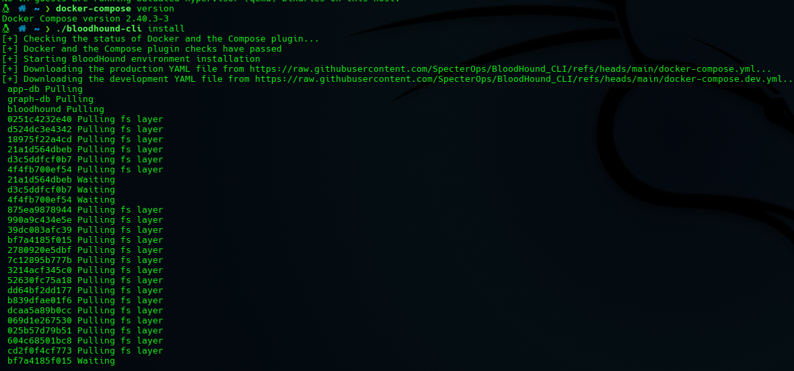 | 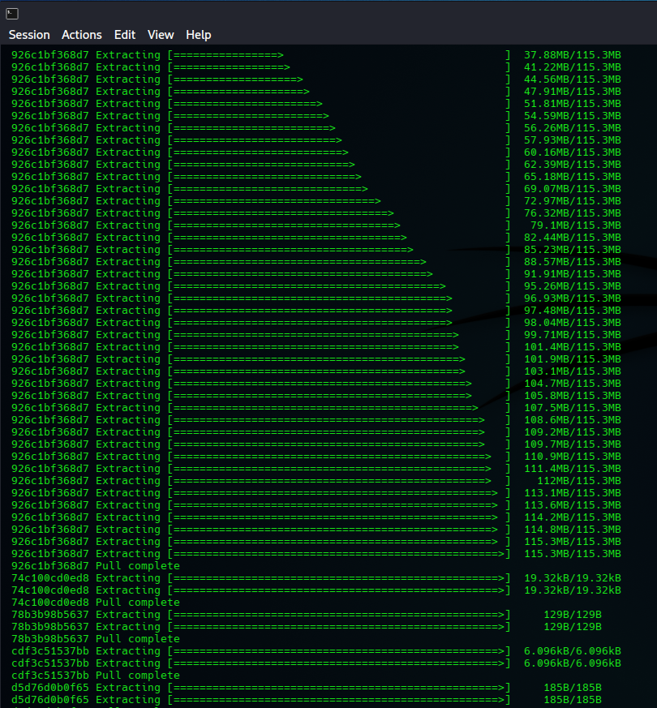 |

BloodHound CE confirmed ready and accessible via browser.

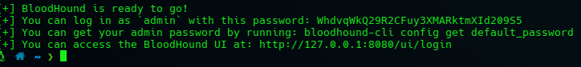

---

## 🌐 Phase 2 - Kali Network Validation

Connectivity from Kali to the domain was verified before collection.

| Check | Result |
|-------|--------|
| Kali IP configuration | ✅ 192.168.10.30 |
| DNS configured to DC01 | ✅ 192.168.10.10 |
| Ping DC01 | ✅ Reachable |
| Ping corp.local | ✅ DNS resolving |

| IP Config | DNS Config |
|-----------|------------|
| 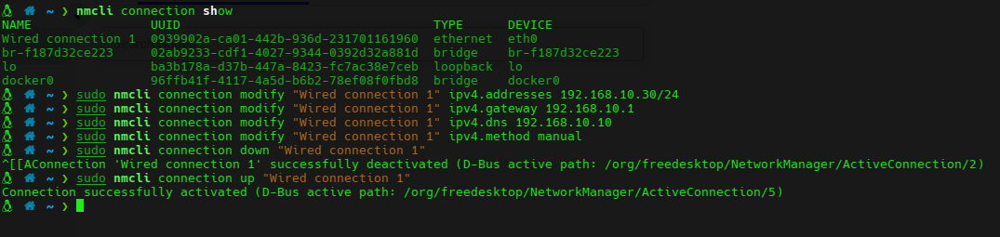 | 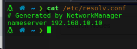 |

| Ping DC01 | Ping corp.local |
|-----------|-----------------|
| 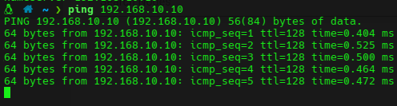 | 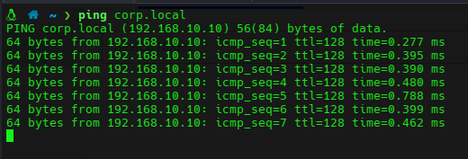 |

---

## 📡 Phase 3 - bloodhound-python Collection

Domain data was collected remotely from Kali using `bloodhound-python`
with `jsmith` credentials - no agent required on the target.

```bash
bloodhound-python -u jsmith -p 'P@ssw0rd!' \
  -d corp.local -ns 192.168.10.10 -c All
```

| Collection Running | JSON Output Files |
|--------------------|-------------------|
| 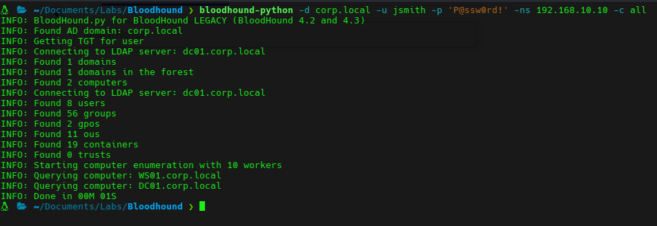 | 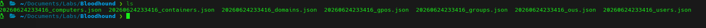 |

> **Note:** `bloodhound-python` runs entirely from Kali over LDAP/RPC -
> no binary needs to be dropped on a domain-joined machine, making this
> the stealthier collection method compared to SharpHound.

---

## 🩸 Phase 4 - BloodHound Ingestion & Analysis

JSON files were imported into BloodHound CE and the domain graph was analyzed.

### Login & Import

| BloodHound Login | Data Import |
|-----------------|-------------|
| 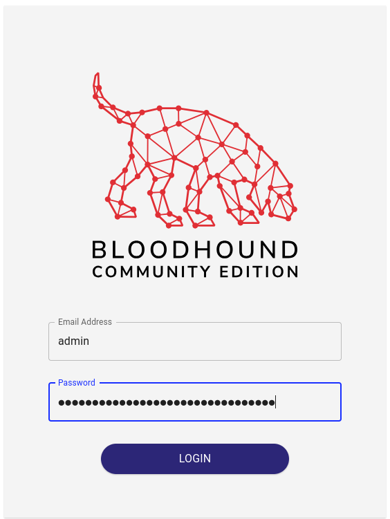 | 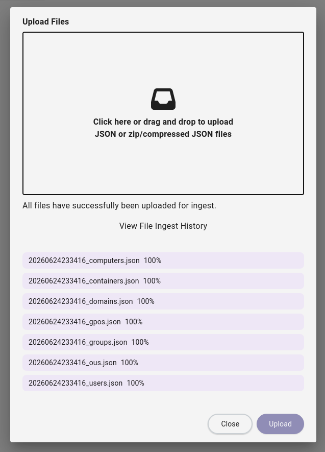 |

### Domain Dashboard

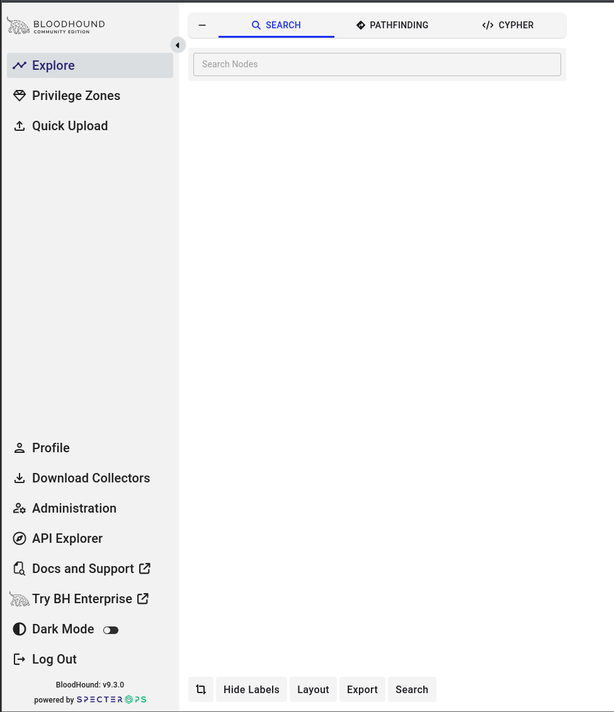

### Full Domain Graph

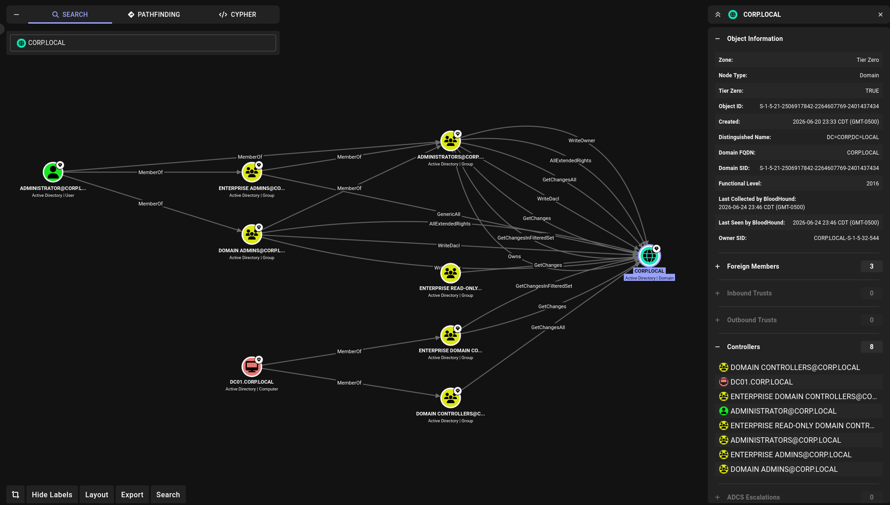

---

## 🚨 Phase 5 - Attack Path Analysis

### jsmith Node - Initial Review

`jsmith` was selected in BloodHound to map outbound relationships
and control permissions.

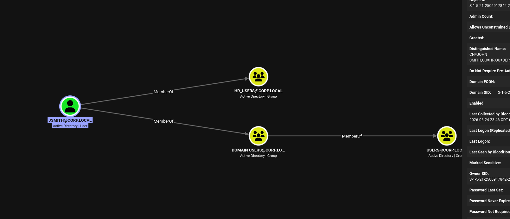

---

### Inbound Object Control

BloodHound revealed that `jsmith` holds **inbound object control**
over highly privileged groups:

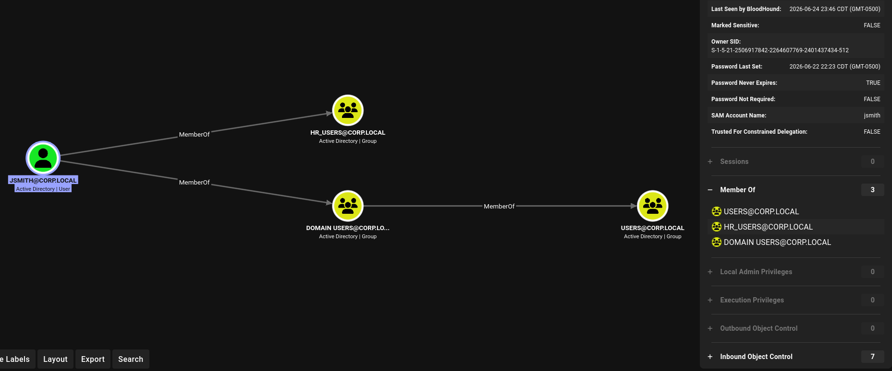

| Relationship | Source | Target | Risk |
|-------------|--------|--------|------|
| WriteDACL / GenericWrite | jsmith | Domain Admins | 🔴 Critical |
| WriteDACL / GenericWrite | jsmith | Enterprise Admins | 🔴 Critical |
| WriteDACL / GenericWrite | jsmith | Administrators | 🔴 Critical |

> A standard HR user with object control over Domain Admins is a
> **critical misconfiguration** - Priority 1 in any real AD assessment.

---

### Attack Path Relationships

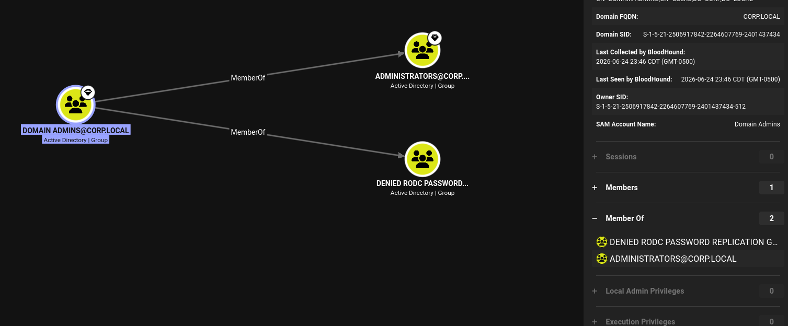

---

### Final Escalation Path - jsmith → Domain Admin

```text
jsmith (Standard HR User)
      ↓  WriteDACL on Domain Admins
Modify group ACL → Add self to Domain Admins
      ↓
CORP\Domain Admins
      ↓
Full Domain Compromise
```

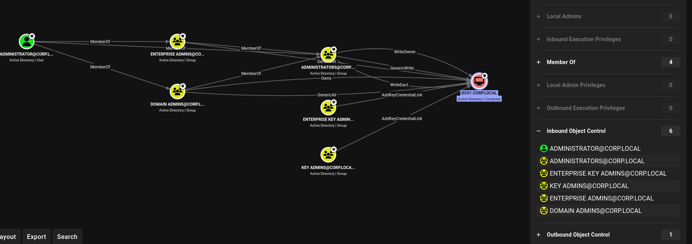

---

## 🧠 Key Findings

| Finding | Severity | Description |
|---------|----------|-------------|
| jsmith WriteDACL on Domain Admins | 🔴 Critical | Standard user can escalate to DA |
| jsmith WriteDACL on Enterprise Admins | 🔴 Critical | Full forest compromise possible |
| Remote collection via bloodhound-python | ⚠️ Notable | No agent needed - LDAP/RPC sufficient |
| Anonymous enumeration blocked | 🟢 Secure | Phase 6 hardening effective |
| SMB signing enforced | 🟢 Secure | Relay attacks mitigated |

---

## 🛡️ Recommended Mitigations

| Finding | Mitigation |
|---------|------------|
| WriteDACL on privileged groups | Audit and remove non-admin ACL entries on tier-0 groups |
| Excessive object control | Implement AD tiering model (Tier 0 / 1 / 2) |
| ACL misconfigurations | Run BloodHound regularly as part of AD hygiene |
| Remote LDAP collection possible | Restrict LDAP queries; monitor for bulk enumeration (Event ID 1644) |

---

## 🧠 Key Learnings

- `bloodhound-python` collects the same data as SharpHound entirely over
  the network - no binary on the target, harder to detect
- BloodHound surfaces ACL misconfigurations that are invisible through
  standard AD tools - manual ACL review across thousands of objects is
  not realistic
- A `WriteDACL` edge on `Domain Admins` from a standard user means full
  domain compromise without ever touching a privileged account directly
- BloodHound CE via Docker is the fastest way to get the full community
  edition running in a lab - no manual dependency management
- Effective AD defense requires both technical controls and regular
  BloodHound-style ACL audits

---

## ✅ Outcome

| Phase | Result |
|-------|--------|
| BloodHound CE setup | ✅ Deployed via Docker |
| Kali network validation | ✅ Full connectivity to corp.local |
| bloodhound-python collection | ✅ All domain data collected remotely |
| BloodHound ingestion | ✅ Domain graph generated |
| Attack path analysis | 🔴 Critical path found - jsmith → Domain Admin |

`jsmith`, a standard HR user, holds a direct privilege escalation path
to Domain Admin through ACL misconfigurations - a realistic critical finding
that would be Priority 1 in any real AD security assessment.

👉 **Next:** [Phase 9 - Detection Engineering](../09-Detection-Engineering/)