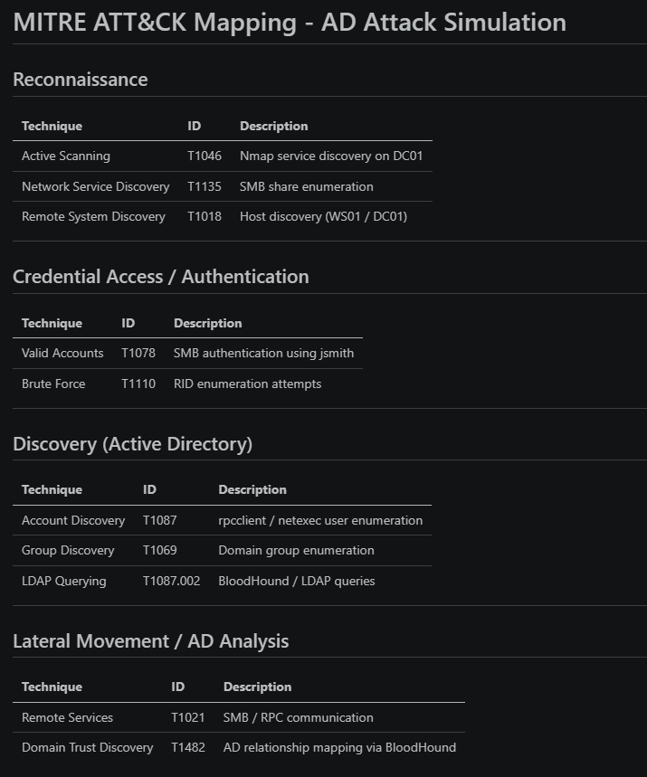
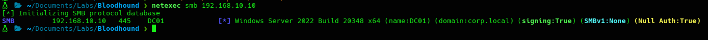
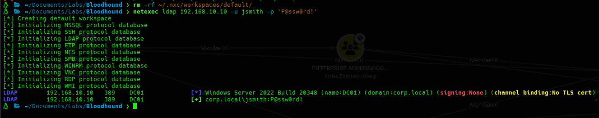
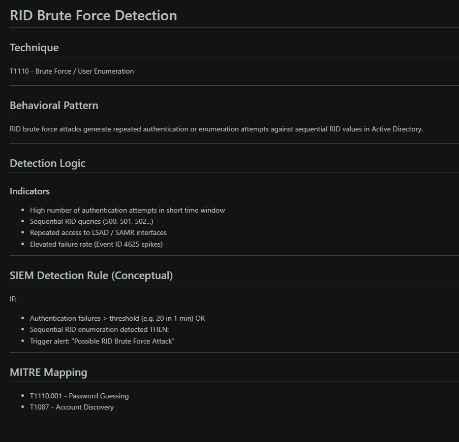
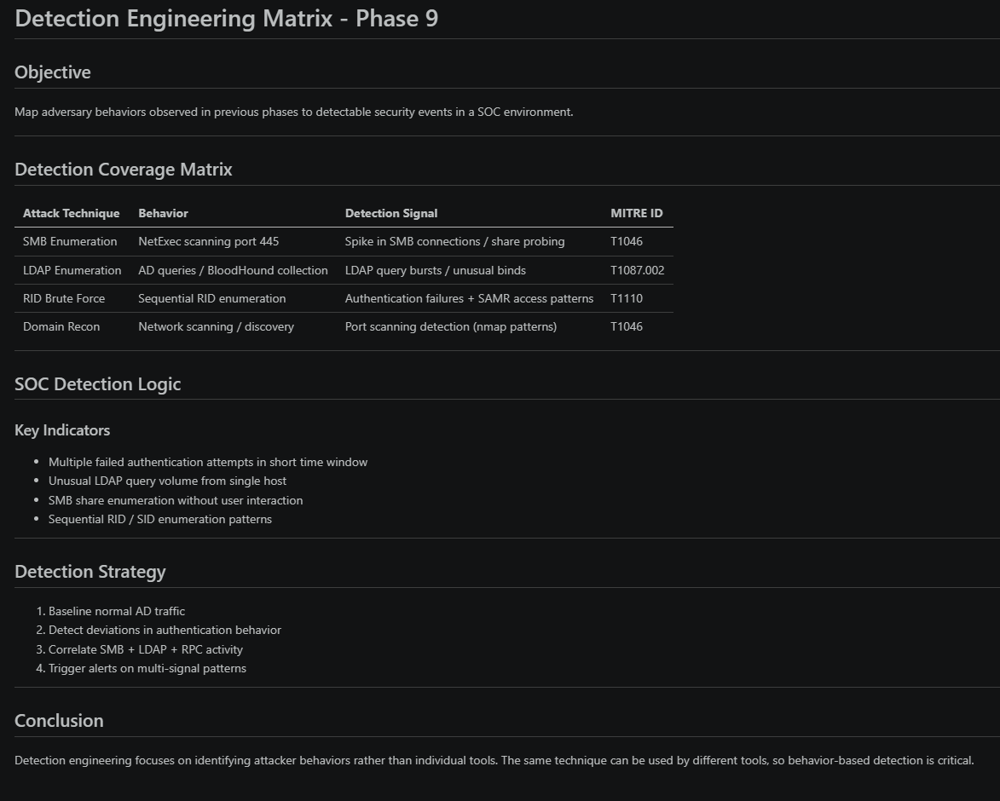

# 🛡️ Phase 9 - Detection Engineering

## 🎯 Objective

Translate adversary behaviors observed in Active Directory attack simulation into detection engineering logic using MITRE ATT&CK mapping, behavioral analytics, and SOC-style detection design.

This phase focuses on identifying **how attacks are detected**, not just how they are executed.

---

## 🧱 Environment Context

| Role | Host | IP |
|------|------|----|
| Domain Controller | DC01.corp.local | 192.168.10.10 |
| Workstation | WS01.corp.local | 192.168.10.20 |
| Attacker | Kali Linux | 192.168.10.30 |
| Domain | corp.local | - |

---

## 🧠 MITRE ATT&CK Mapping

| Technique | ID | Description |
|-----------|----|-------------|
| Network Service Scanning | T1046 | Discovery of open ports and services |
| Account Discovery | T1087 | Enumeration of domain users and groups |
| LDAP Enumeration | T1087.002 | Active Directory querying via LDAP |
| Brute Force / RID cycling | T1110 | Sequential identity enumeration |

---

## 🔍 SMB Enumeration Detection (DC01)

### Behavioral Indicators

- Multiple SMB connections to TCP/445
- Share enumeration activity
- Non-interactive access patterns from single host

### Detection Logic

IF:
- SMB connection spike from single IP
OR
- Share enumeration without user interaction
THEN:
- Alert: "SMB Reconnaissance Activity Detected"

---

## 📡 LDAP Active Directory Enumeration

### Behavioral Indicators

- High frequency LDAP queries
- Enumeration of users, groups, and domain structure
- Repeated bind requests from same source

### Detection Logic

IF:
- LDAP query volume exceeds baseline threshold
OR
- Bulk directory enumeration detected
THEN:
- Alert: "Active Directory Enumeration Detected"

---

## 🔐 RID Brute Force Detection

### Behavioral Indicators

- Sequential RID enumeration patterns
- Repeated authentication failures (Event ID 4625)
- SAMR/LSAD abuse patterns

### Detection Logic

IF:
- Sequential RID access pattern detected
OR
- High authentication failure rate in short time window
THEN:
- Alert: "RID Brute Force / Account Enumeration Attempt"

---

## 📊 Detection Matrix (SOC Correlation Model)

| Attack Technique | Behavior | Detection Signal | MITRE ID |
|------------------|----------|------------------|----------|
| SMB Enumeration | Port scanning / share probing | SMB connection spikes | T1046 |
| LDAP Enumeration | AD queries / directory recon | LDAP query bursts | T1087.002 |
| RID Brute Force | Sequential RID guessing | Auth failures + SAMR activity | T1110 |
| Network Recon | Host/service discovery | Port scanning patterns | T1046 |

---

## 🧠 Detection Engineering Strategy

### Core Principles

1. Detect **behavior**, not tools
2. Correlate weak signals into strong alerts
3. Baseline normal AD traffic first
4. Combine SMB + LDAP + authentication telemetry

---

## 🚨 Key Detection Insights

- SMB enumeration is an early-stage reconnaissance technique
- LDAP enumeration is strongly correlated with BloodHound-style recon
- RID brute force indicates account discovery attempts
- Individual events are low fidelity → correlation is required

---

## 🛡️ Defensive Recommendations

| Finding | Mitigation |
|--------|------------|
| SMB enumeration | Restrict SMB exposure + monitor port 445 spikes |
| LDAP enumeration | Enable LDAP signing + monitor query anomalies |
| RID brute force | Implement lockout policies + rate limiting |
| AD reconnaissance | Centralized logging + SIEM correlation rules |

---

## 🧠 Key Learnings

- Detection engineering focuses on **attack behavior patterns**
- MITRE ATT&CK provides structure but not detection logic
- SMB, LDAP, and RID enumeration are often chained together in real attacks
- Correlation across logs is more powerful than single-event alerts
- BloodHound-style recon can be detected through query volume patterns

---

## 🎯 Outcome

| Area | Result |
|------|--------|
| MITRE mapping | ✅ Completed |
| SMB detection logic | ✅ Implemented |
| LDAP detection logic | ✅ Implemented |
| RID brute detection | ✅ Implemented |
| SOC correlation matrix | ✅ Completed |

---

## 🚀 Next Phase

👉 Phase 10 - Detection Rules (Sigma / SIEM implementation)